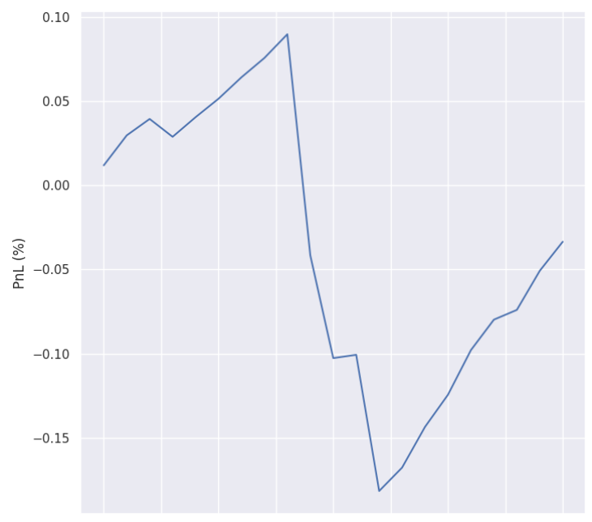
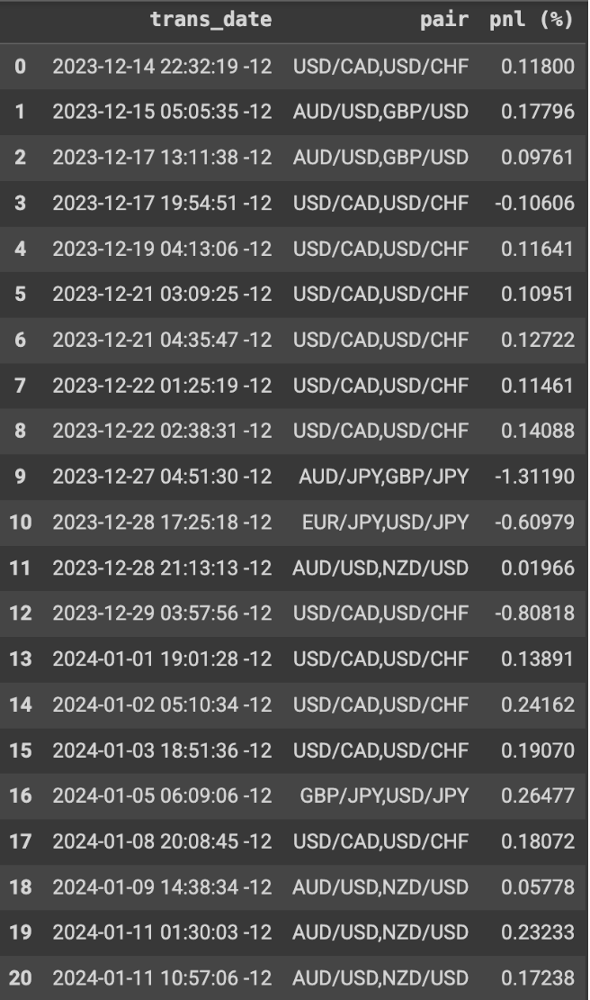

# Automated Forex Trading System with Correlation-Based Pair Selection and Linear Regression Modeling

## Background
I have developed an automated trading system using Python scripts and using Oanda’s API to trade on a demo account. I have deployed the scripts to run on a virtual private server to automate the trades.

## Methods
- Forex pair selection based on correlation values (i.e. > 0.95)
- Model correlation relationship using linear regression
- Execute trades when correlation drifts (using standard deviation value) 

## Implementation
I created 3 python scripts for different purposes:
1) Pairs selection based on correlation values. (To be added to the repo)
2) Linear regression fit on pairs considered.
3) Trade execution (using Oanda’s API) using the trained linear regression model (from script 2) according to predefined standard deviation threshold rule.

## Results (from 14 December 2023 to 14 January 2024)
Number of trades: 21 Win rate: 81% PnL (%): -3.34%
**PnL in percentage over time:**

The trans_date is the date time when the algorithm exits the position for both pairs. As observed, due to the absence of stop-loss, the losses in row 9, 10, 12 is huge.

Pros
- Assumes that correlation changes (pairs selection and model is always up-to-date)
- Simple model, doesn’t require much computation

Cons
- No stop-loss (correlation may continue drifting and not revert back to the mean)
- Too many parameters to tune, and difficult to backtest
- Linear regression is train on 1 week data, but that may not be the optimal
- Pairs selection based on correlation (over 1 month data)

## Improvements
- Set stop-loss if correlation drifts too much (using standard deviation value)
- Use weighted linear regression based on time
- Implement backtest (extract forex data when the correlation is 0.95, and execute the strategy on those data) and do hyperparameter tuning for linear regression data duration (i.e. 1 week data) and pairs selection data duration (i.e. 1 month data)